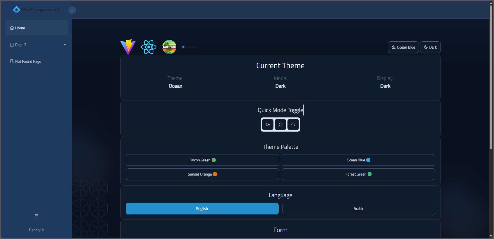
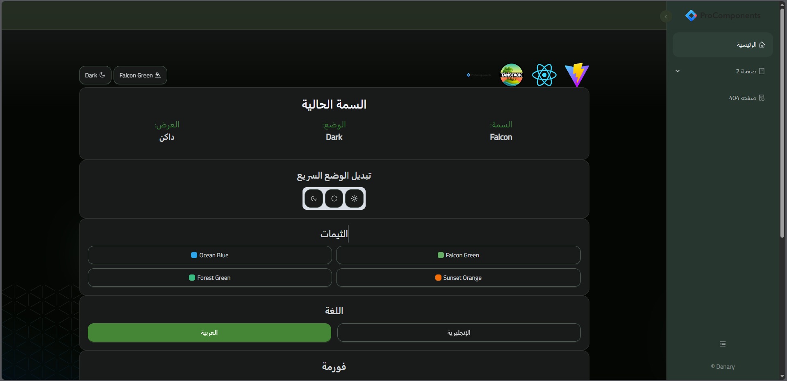
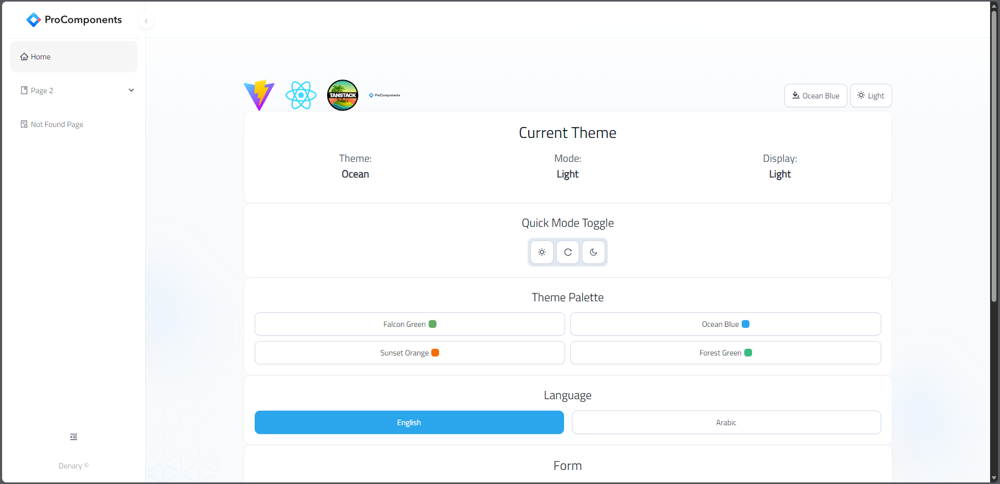
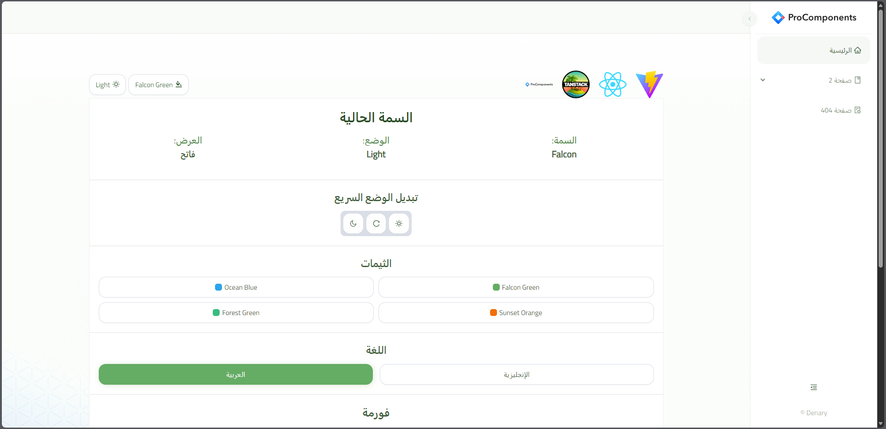
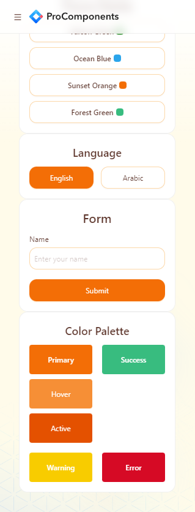
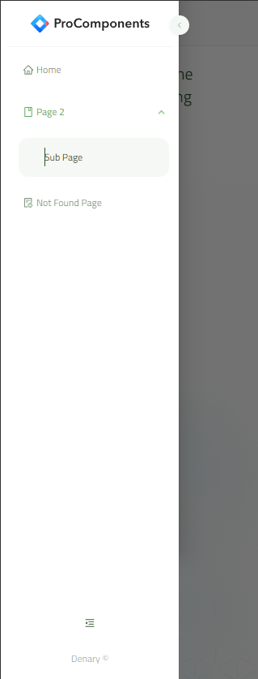

# MVP React Template

This template provides a minimal yet powerful setup to get **React** working with **Vite**, **Ant Design**, **Ant Design Pro Components**, **Tailwind CSS**, and **TanStack Query** & **Router** — all configured for rapid MVP development and personal projects.

---

## 🧩 Technologies Used

- [**React**](https://react.dev/) — A JavaScript library for building user interfaces.  
- [**Vite**](https://vitejs.dev/) — Next-generation, lightning-fast frontend tooling.  
- [**TanStack Query**](https://tanstack.com/query/latest) — Powerful asynchronous state management for React.  
- [**TanStack Router**](https://tanstack.com/router/latest) — Type-safe, modern router for React applications.  
- [**Ant Design (Antd)**](https://ant.design/) — A popular React UI framework with rich, enterprise-ready components.  
- [**Ant Design Pro Components**](https://procomponents.ant.design/) — Advanced layout and component suite built on top of Ant Design.  
- [**Tailwind CSS**](https://tailwindcss.com/) — Utility-first CSS framework for building responsive, modern UIs.  
- [**i18next (react-i18next)**](https://react.i18next.com/) — Internationalization framework for multi-language support.

---

## ✨ Features

1. **Offline-first support**  
2. **Multiple themes**, including Light and Dark modes for each.  
3. **RTL (Right-to-Left)** layout support.  
4. **Router with Breadcrumbs** (powered by ProLayout and TanStack Router).  
5. **Responsive design** for Header and Side Menu.  
6. **Fully customizable** components and configuration.  
7. **Multi-language support** — currently Arabic 🇸🇦 and English 🇬🇧.

---

## 🎨 Theme Previews

| Dark Blue | Dark Green (AR) | Light Blue | Light Green (AR) |
|------------|------------------|-------------|------------------|
|  |  |  |  |

---

## 📱 Mobile View

  
  

---

> ⚠️ **Note:**  
> This template is intended for **personal projects and MVPs**.  
> The file structure may **not be optimized for enterprise-scale applications or large teams**.
